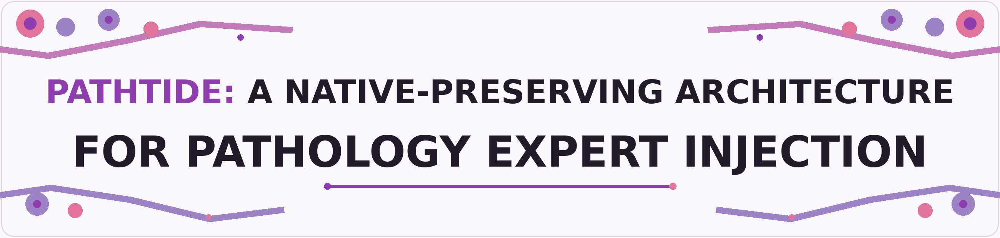
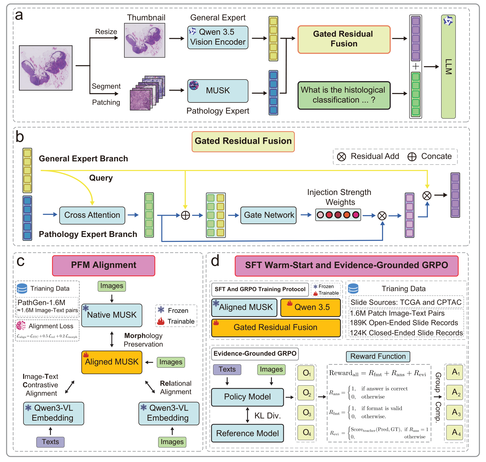

  

---

### 👥 Authors

Click to expand author list

 

<!-- Author list will be added before the paper release. -->

---

### 🏥 Affiliations

Click to expand affiliations

 

<!-- Affiliations will be added before the paper release. -->

---

## Overview

**PathTIDE** (**Path**ology **T**oken **I**njection of **D**omain **E**xperts) is a
PFM-agnostic architecture for integrating pathology-specific visual evidence
into a pretrained vision-language model (VLM) without replacing its native
visual pathway.

Its design combines three components:

- **General Expert Branch:** retains the pretrained VLM vision encoder and its
  native visual-language interface.
- **Pathology Expert Branch:** introduces fine-grained pathology evidence from
  an interchangeable pathology foundation model (PFM).
- **Gated Residual Fusion:** retrieves expert evidence through cross-attention
  and injects it with learned token-wise gates.

Our implementation uses Qwen3.5-9B as the general-purpose VLM and MUSK as the
Pathology Expert. The architecture itself is not restricted to a specific PFM.

 

### Evaluation

PathTIDE is evaluated on PathMMU, SlideBench-VQA-TCGA,
SlideBench-VQA-CPTAC, and the closed-ended portion of WSI-Bench. The same
trained checkpoint supports both PFM-Free and PFM-Full inference.

> Across these benchmarks, native-preserving gated expert injection
> outperforms General Expert replacement and ungated residual addition.

---

## Architecture

  

  <em>Overview of PathTIDE, including native-preserving expert injection, PFM alignment, and the SFT–GRPO training protocol.</em>

High-resolution assets: [architecture PDF](Assets/PathTIDE.pdf) ·
[PathTIDE icon PDF](Assets/PathTIDE_Icon.pdf)

---

## Release Status

> [!NOTE]
> This repository currently provides the PathTIDE project overview and visual
> assets. Training and evaluation code will be added at a later stage.

---

## Citation

Citation information will be added with the paper release.
